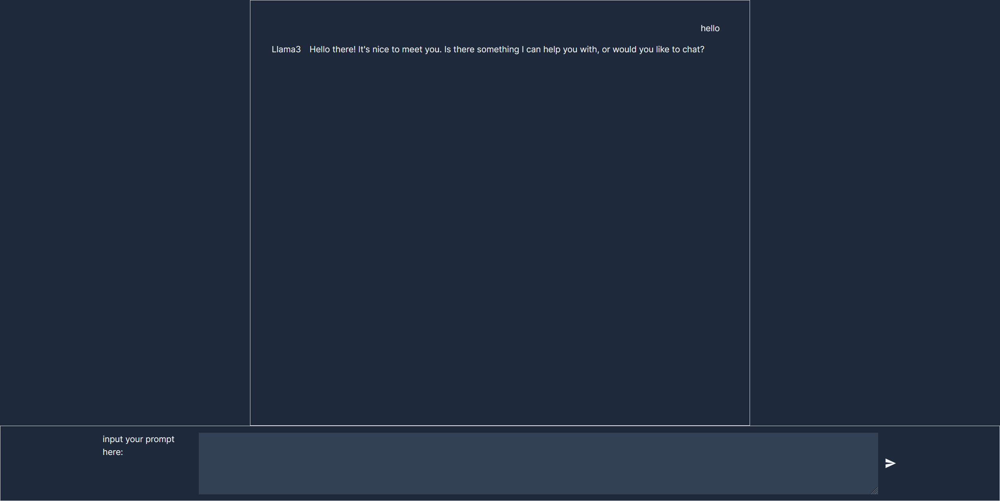

This is a Chatting Web UI. It involves no more than 300 line codes of TS, so it is simple and easy to learn.



## Requirement

+ Nodejs
+ Ollama

You can find the download addreas and installation instruction here: 
+ https://nodejs.org/en/download
+ https://github.com/ollama/ollama/tree/main

## Getting Started

```bash
ollama pull llama3 # Pull the llama3 weight
npm i # install the dependencies of web
npm run build # pack the web
npm run start # # enjoy
```

